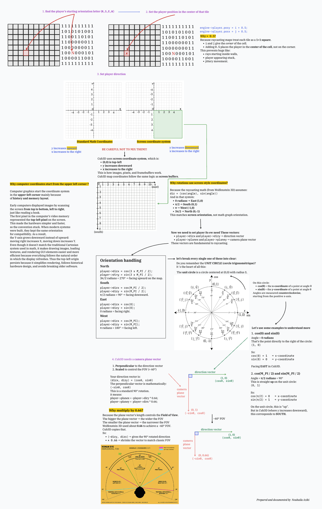
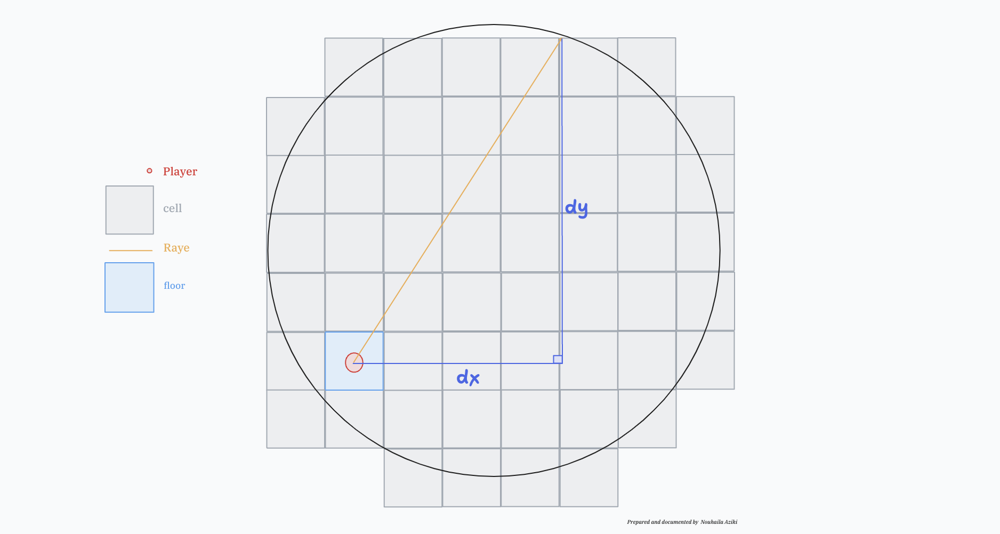
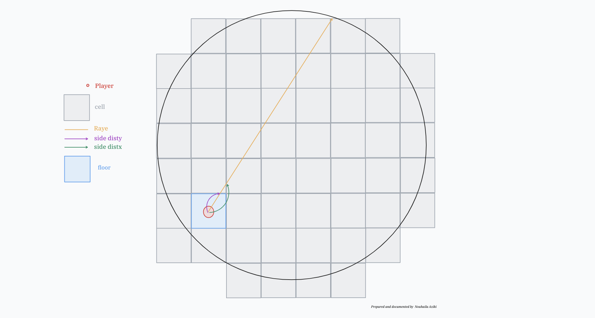
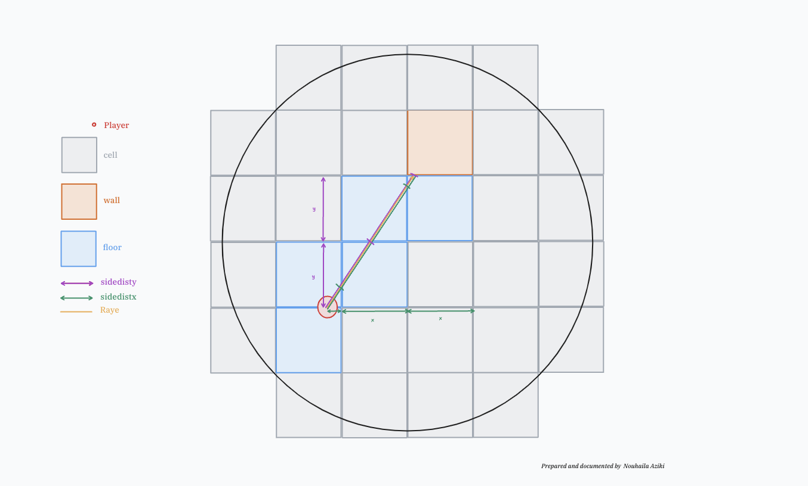
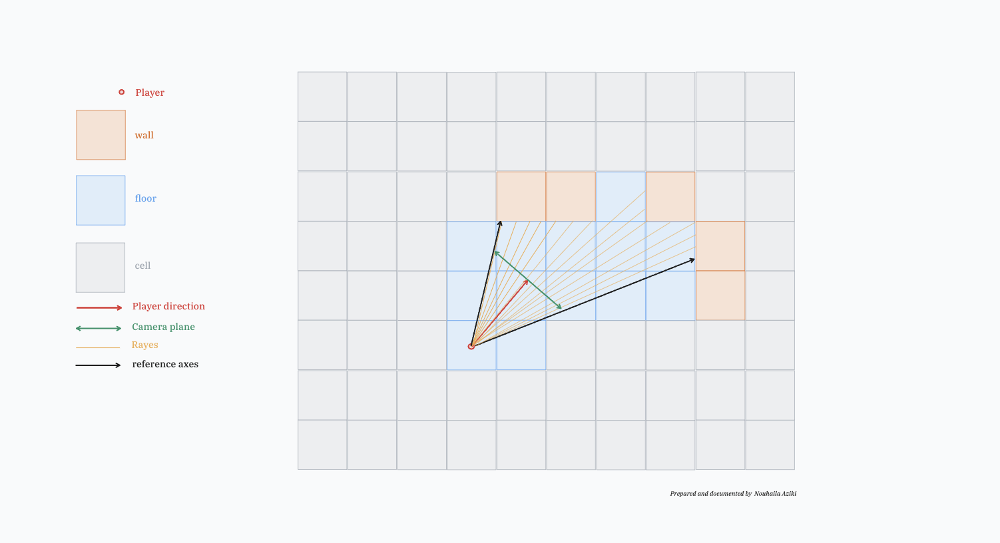

# 𝐒𝟎𝐋𝐈𝐃∆𝐍𝐆𝐋𝐄 - cub3D
cub3D is a 3D graphical project from the 42 curriculum. The goal is to create a basic 3D game engine using raycasting, inspired by early games like Wolfenstein 3D. It uses the MiniLibX graphics library to render a 3D view from a 2D map, allowing the player to move around and interact with the environment.


## 📑 Table of Contents
1. [MLX42 library](#mlx42-library)
2. [Explanation of Key Concepts](#explanation-of-keys-concepts)
	1. [Player Start & Camera Orientation](#1-player-start--camera-orientation)
	2. [The Ray’s Geometric Meaning](#2-the-rays-geometric-meaning)
	3. [First X/Y Grid Intersection (Side Distances)](#3-first-xy-grid-intersection-side-distances)
	4. [DDA Grid Traversal (Marching Through Tiles)](#4-dda-grid-traversal-marching-through-tiles)
	5. [Field of View: All Rays for the Frame](#5-field-of-view-all-rays-for-the-frame)
	6. [Wall Projection](#6-wall-projection)
	7. [Colors = 32-bit Packed Ints](#7-colors--32-bit-packed-ints)
	8. [Minimap = Same Math, Different Scale](#8-minimap--same-math-different-scale)
	9. [Movement = Direction or Plane Vector + Collision](#9-movement--direction-or-plane-vector--collision)
	10. [Exit = Reverse of Boot](#10-exit--reverse-of-boot)
3. [Contributors](#contributors)  
4. [Documentation](#documentation)
---

## MLX42 library

MLX42 is a **graphics library** made by 42 Network students as a modern replacement for the original **MiniLibX (mlx)** that was provided by 42 school.

Here’s the breakdown:

### What it is

- **MLX42** is a lightweight C library built on **OpenGL** and **GLFW**.

- It provides a simple API to create a window, handle keyboard/mouse input, and draw images/pixels.

- It’s designed to be cross-platform (Linux, macOS, sometimes Windows with tweaks), unlike the old MiniLibX which had a lot of platform limitations.

### Why it exists

- The original MiniLibX was outdated, buggy, and heavily tied to X11 (Linux) or Quartz (macOS).

- Many students had problems compiling it, especially on modern macOS.

- MLX42 is meant to be easier to install, more reliable, and more flexible.

### What you can do with MLX42

Create a window and render graphics.

Handle events (keyboard, mouse, window resize, close).

Draw pixels, lines, textures, and images.

Use OpenGL under the hood, but without needing to learn OpenGL directly.

### Download MLX42

To download MLX42, visit the following link and follow the instructions:

[MLX42 on GitHub ↗](https://github.com/codam-coding-college/MLX42)

---

## Explanation of Keys Concepts
### 1. Player Start & Camera Orientation
The Map Is Just a 2D Grid
Think of the map like a chess board:
  - Every cell is 1×1 unit in size
  - '1' means solid wall
  - '0' means walkable floor
  - 'N','S','E','W' are temporary markers that only exist to tell you where the player should spawn and which way they look
  - 'D','O','M' are bonus objects like doors/enemies
Nothing is drawn until you decide what to do with this grid.
See the diagram below for a visual explanation of player initialization and camera orientation.


### 2. The Ray’s Geometric Meaning

This diagram visualizes a single ray that the player shoots in the world. The scene is drawn as:

- A grid = your map (each square = 1×1 tile)
- A player somewhere inside the grid
- A ray going from the player to some direction
- Two distances labeled:
	- dx = horizontal difference
	- dy = vertical difference

This diagram explains what a ray direction vector truly is.
When you compute:
```c
raydirx = player.dirx + player.planex * camerax;
raydiry = player.diry + player.planey * camerax;
```

You generate a 2D vector pointing somewhere in the world.

This vector is nothing more than:
- dx = raydirx
- dy = raydiry

This diagram shows the raw geometry behind the numbers your raycasting code computes.

### 3. First X/Y Grid Intersection (side distances)

This diagram introduces the core of the DDA algorithm:
- The player stands inside a grid square.
- A ray shoots at an angle.
- Two colored distances appear:
	- One shows the distance to the next vertical grid line
	- One shows the distance to the next horizontal grid line

These match **sidedistx** and **sidedisty** in your code.

Before the ray can march tile by tile, you must compute:
```c
if (raydirx < 0)
    sidedistx = (player.posx - mapx) * deltadistx;
else
    sidedistx = (mapx + 1 - player.posx) * deltadistx;
```

and the same for Y.

### What Are deltadistx and deltadisty?

They represent:

```The exact distance a ray must travel to cross one grid line in the X or Y direction.```

Your world is a grid of 1×1 tiles.

A ray moves through this grid diagonally; it is not aligned with X or Y.
So we must know:
- If the ray steps one tile in X, how far did it actually travel?
- If the ray steps one tile in Y, how far did it actually travel?

Because a diagonal movement is longer than a straight movement, the distance per grid-step is not 1.
That’s what `deltadistx` and `deltadisty` measure.

The diagram shows the first time the ray reaches:
- A vertical boundary (X-side)
- A horizontal boundary (Y-side)
These determine which tile the ray enters next.

You visually see how DDA decides:
```c
if (sidedistx < sidedisty)
    move in X direction
else
    move in Y direction
```
### 4. DDA Grid Traversal (marching through tiles)


This one illustrates the DDA loop itself:
- A ray travels through multiple tiles
- Each time it hits a grid boundary:
	- It moves into the next tile
	- It adds either:
		- deltadistx to sidedistx
		- OR deltadisty to sidedisty
- Eventually, it hits a wall tile
The tiles are labelled visually to show which ones the ray traverses.

This diagram explains what my code does inside:
```c
while (!hit)
    hit = dda_step(engine);
```

Inside dda_step() I do:
```c
if (sidedistx < sidedisty)
{
    sidedistx += deltadistx;
    mapx += stepx;
    side = 0;  // hit vertical wall
}
else
{
    sidedisty += deltadisty;
    mapy += stepy;
    side = 1;  // hit horizontal wall
}
```

The diagram visualizes this exactly:

- Compare X-side vs Y-side

- Move to the tile whose boundary is hit first

- Repeat until the ray hits a wall

### 5. Field of View: All Rays for the Frame


This final diagram displays:
- The player’s facing direction
- The camera plane
- Many rays fanning out across the screen width
- Walls positioned in the world
- Rays hitting walls at different distances

This matches my rendering loop:
```c
for (x = 0; x < SCREEN_WIDTH; x++)
{
    setup_ray();
    set_ray_deltas();
    set_initial_sides();
    perform_dda();
    calculate_wall_projection();
    draw_textured_line();
}
```
### 6. WALL PROJECTION
Wall projection is the final step of raycasting, where you take the 2D collision information from the DDA system and convert it into a vertical line that represents the wall slice in 3D space.

In simpler terms:

`Wall projection transforms a 2D world hit into a 3D screen height.`

At this moment, the raycast has given you:

- The tile that the ray hit (`mapx`, `mapy`)

- Whether the collision happened horizontally or vertically (side)

- The direction of the ray (`raydirx`, `raydiry`)

- The player’s position (`posx`, `posy`)

- The step direction (`stepx`, `stepy`)

Now you must compute how far away that wall is from the player.

### WHY YOU MUST USE PERPENDICULAR DISTANCE (NOT RAW RAY LENGTH)

Imagine standing in front of a wall and looking forward.
- The wall directly in front of you looks tall.
- Walls at an angle appear short, because your eye is not perpendicular to them.

If you used the raw length of the ray (a diagonal), walls would stretch and shrink incorrectly:

This is called **fish-eye** distortion.

Perpendicular distance fixes this

Perpendicular distance is the projection of the ray onto the camera’s orientation vector — the true “forward” distance.

My code:
```c
if (engine->side == 0)
    engine->perpwalldist = (engine->mapx - engine->player.posx
        + (1 - engine->stepx) / 2) / engine->raydirx;
else
    engine->perpwalldist = (engine->mapy - engine->player.posy
        + (1 - engine->stepy) / 2) / engine->raydiry;
```

This gives the true shortest distance from the player to the wall plane.

### WHAT THIS FORMULA MEANS EXACTLY

If the ray hit a vertical wall (side = 0):
```c
perp = (distance from player to that vertical grid line) / raydirx
```
If the ray hit a horizontal wall (side = 1):
```c
perp = (distance from player to that horizontal grid line) / raydiry
```

This division is extremely important:
```Because `raydir`x or `raydiry` tells you how far along the ray you must travel in world units to reach 1 unit in that axis.```
Thus the formula gives the exact ray-distance along the camera’s forward projection, not the diagonal ray-length.

### CONVERTING DISTANCE INTO WALL HEIGHT

This is the famous pinhole-camera formula:
```c
engine->lineheight = (int)(SCREEN_HEIGHT / engine->perpwalldist);
```

This is equivalent to:
```c
projected_height = constant / distance
```

Where the constant is screen height.

### Why does dividing by distance work?

Because in perspective projection:
- Objects close to you look big (small denominator → large result)
- Objects far away look small (large denominator → small result)

This single mathematical relationship creates the entire illusion of 3D depth.

### FINDING WHERE THE WALL LINE STARTS AND ENDS

The midpoint of the screen is your camera's eye level.

Your line is centered around that midpoint:
```c
engine->drawstart = -engine->lineheight / 2 + SCREEN_HEIGHT / 2;
engine->drawend   =  engine->lineheight / 2 + SCREEN_HEIGHT / 2;
```

Conceptually:
```c
SCREEN MIDDLE
     ↓
 ------------------------
|          ↕            |
|     (wall slice)      |
|          ↕            |
 ------------------------
```

This ensures:

- Every wall is vertically centered
- Tall walls extend above and below the midpoint
- Short walls stay near the middle
- Ceiling remains above
- Floor remains below

You clamp the values so the wall does not draw outside the screen:
```c
if (engine->drawstart < 0)
    engine->drawstart = 0;
if (engine->drawend >= SCREEN_HEIGHT)
    engine->drawend = SCREEN_HEIGHT - 1;
```
### PUTTING EVERYTHING TOGETHER
1. The entire wall projection process:
2. DDA finds the exact tile the ray hit.
3. Determine which side was hit (vertical/horizontal).
4. Compute perpendicular wall distance.
5. Compute line height = screen_height / distance.
6. Compute start and end positions vertically.
7. Draw one vertical textured line at screen column x.
8. Repeat for every screen column → you get a full 3D view.

This is how DOOM, Wolfenstein 3D, and our cub3d create 3D graphics from a 2D map.

### 7. Colors = 32-bit packed ints

All colors are `32` bits: `0xRRGGBBAA`.

`<<24`, `<<16`, `<<8` shifts the r,g,b values into the 32-bit integer to form a final pixel color.

### 8. Minimap = Same Math, Different Scale

Minimap rendering doesn’t invent new logic. It reuses world positions.

- Draw a filled circle background
- For each map tile, compute relative distance to player
- If it fits inside the circle radius, draw a 6×6 pixel block using the color from `get_tile_color`
- Player marker is also a `6×6` block in the circle center
- Circular border is drawn by sampling 0→360° using cos/sin.

So the minimap uses the same coordinate system, same unit circle math, same tile meaning, just scaled differently.

### 9. Movement = Direction or Plane Vector + Collision

Movement uses:
- dir vector for forward/back
- plane vector for strafing
Before confirming movement, collision is checked using check_collision:
- Map borders are enforced
- Tiles and door hitboxes block movement
- `isfinite` avoids NaN/infinite movement bugs
Pressing ESC prints your farewell message, then closes the window.

### 10. Exit = reverse of boot

After `mlx_loop` ends:

- cleanup textures

- cleanup enemy textures

## Contributors

- Nouhaila Aziki  
- Hajar El Houbbadi

## Documentation

- Nouhaila Aziki

- terminate MLX graphics instance
